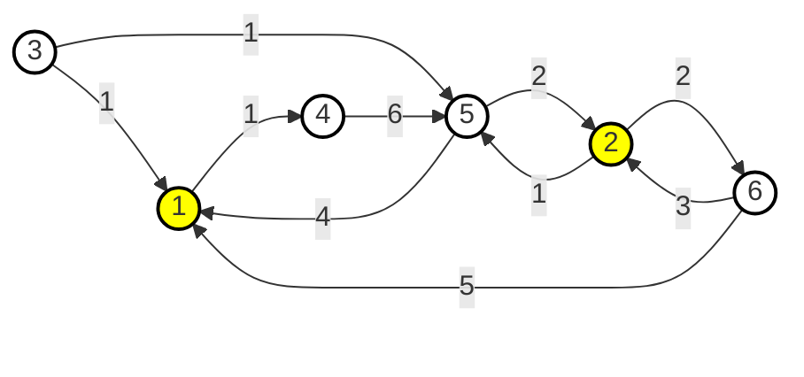
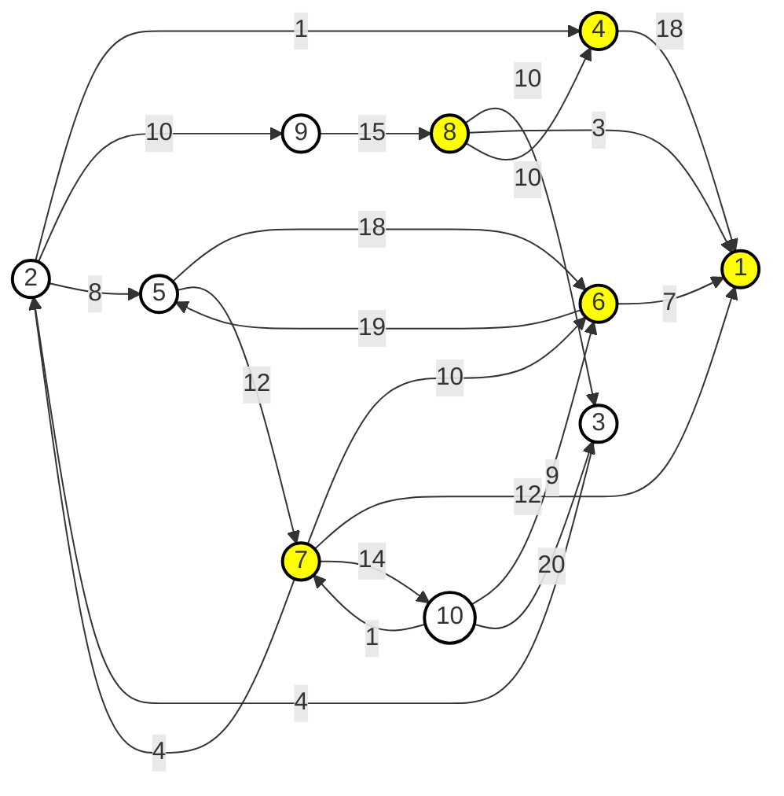
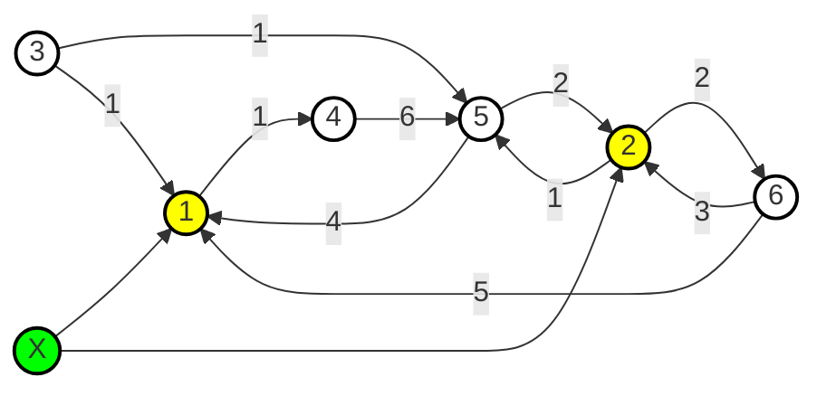

# 면접보는 승범이네 풀이

> 면접자들은 서로 다른 N개의 도시에 거주한다. 승범이는 면접자들의 편의를 위해 거주 중인 N개 도시 중 K개의 도시에 면접장을 배치했다. 도시끼리는 단방향 도로로 연결되며, 거리는 서로 다를 수 있다. 어떤 두 도시 사이에는 도로가 없을 수도, 여러 개가 있을 수도 있다. 또한 어떤 도시에서든 적어도 하나의 면접장까지 갈 수 있는 경로가 항상 존재한다. 모든 면접자는 본인의 도시에서 출발하여 가장 가까운 면접장으로 찾아갈 예정이다. 즉, 아래에서 언급되는 '면접장까지의 거리'란 그 도시에서 도달 가능한 가장 가까운 면접장까지의 최단 거리를 뜻한다. 속초 출신 승범이는 지방의 서러움을 알기에 각 도시에서 면접장까지의 거리 중, 그 거리가 가장 먼 도시에서 오는 면접자에게 교통비를 주려고 한다. 승범이를 위해 면접장까지의 거리가 가장 먼 도시와 그 거리를 구해보도록 하자.

**예제 1번**

정답: 4번 도시, 8

**예제 2번**

정답: 9번 도시, 15

정점 $1, 2, \cdots, N$에 대해서 가장 가까운 면접장까지의 거리가 가장 큰 도시를 찾는 문제입니다. 모든 $1, 2, \cdots, N$ 도시에 대해서 데이크스트라 알고리즘을 수행하면 제한 시간 내에 해결할 수 없습니다.

방향 그래프 $G$에서 $u$와 $v$의 최단 경로는 그래프 $G^T$에서 $v$와 $u$의 최단 경로와 같습니다. 따라서 모든 $1, 2, \cdots, N$ 도시에 대해서 데이크스트라 알고리즘을 수행하는 대신에 $G^T$에서 면접장이 배치된 도시 $a_1, a_2, \cdots, a_K$를 시작으로 데이크스트라 알고리즘을 수행하면 됩니다.



$a_1, a_2, \cdots, a_K$에 대해서 $K$번 데이크스트라 알고리즘을 수행하는 대신에 한 번만 수행해서 해결할 수 있습니다. 임의의 정점 $X$를 그래프에 추가한 후에 $X$와 $a_1, a_2, \cdots, a_K$를 잇는 가중치가 0인 간선을 추가합니다. 이제 $X$에서 시작하는 데이크스트라 알고리즘을 수행하면 됩니다.

# 소스 코드
```cpp
#include <bits/stdc++.h>

using namespace std;

int main() {
    int n, m, k;
    cin >> n >> m >> k;

    vector<vector<pair<int, int>>> adj(n + 1);
    for (int i = 0; i < m; i++) {
        int u, v, w;
        cin >> u >> v >> w;

        adj[v].emplace_back(u, w);
    }

    priority_queue<pair<long long, int>, vector<pair<long long, int>>, greater<pair<long long, int>>> pq;
    vector<long long> d(n + 1, 1e18);

    for (int i = 0; i < k; i++) {
        int x;
        cin >> x;

        pq.emplace(0, x);
        d[x] = 0;
    }

    while (!pq.empty()) {
        auto [cost, here] = pq.top();
        pq.pop();

        if (d[here] < cost) {
            continue;
        }

        for (auto [there, weight] : adj[here]) {
            long long there_cost = cost + weight;
            if (d[there] > there_cost) {
                d[there] = there_cost;
                pq.emplace(there_cost, there);
            }
        }
    }

    pair<long long, int> max(0, 0);
    for (int i = 1; i <= n; i++) {
        max = ::max(max, { d[i], -i });
    }

    cout << -max.second << '\n';
    cout << max.first << '\n';
}

```
