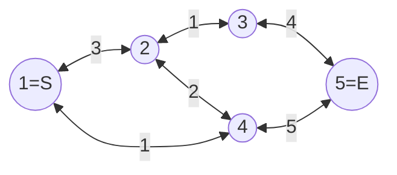
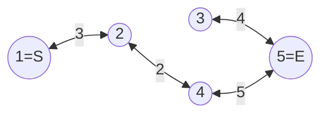
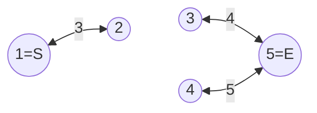

# 중량 제한 풀이



* 부분 그래프(Subgraph)는 어떤 그래프 $G$의 정점과 간선의 부분 집합으로 구성된 그래프입니다.
* 그래프 $G$의 부분 그래프 $G_w$을 $G$의 모든 정점과 간선의 가중치가 $w$ 이상인 간선으로 구성된 그래프라고 정의합니다. 


예를 들어 위 그래프에서 $G_2$는 이와 같습니다.


$G_3$는 이와 같습니다.

* $G_w$에 대해서 $S$에서 $E$로 옮길 수 있는 최대 중량을 구하는 대신에 $S$에서 $E$까지 경로가 존재하는지를 확인하는 것은 간단합니다.
* $f(w)$는 $G_w$에서 $S$에서 $E$까지 경로가 존재하는지 여부를 반환하는 함수로 정의합니다. 문제의 정답은 $f(1), f(2), \cdots, f(10^9)$ 중에서 $f(w)$가 참인 가장 큰 $w$입니다.

* $G_w$에서 $S$에서 $E$까지 경로가 존재한다면 당연히 $G_{w-1}$에서도 마찬가지로 경로가 존재합니다. 이러한 단조성을 이용해 판정함수 $f(w)$는 이분 탐색이 가능합니다.

* 명시적으로 $G_w$를 구성하지 않고, 인접 정점을 탐색할 때 가중치가 $w$이상인 간선만을 확인해도 됩니다.
# 소스 코드
```cpp
#include <bits/stdc++.h>

using namespace std;

int main() {
    int n, m;
    cin >> n >> m;

    vector<vector<pair<int, int>>> adj(n + 1);
    for (int i = 0; i < m; i++) {
        int u, v, w;
        cin >> u >> v >> w;

        adj[u].emplace_back(v, w);
        adj[v].emplace_back(u, w);
    }

    int s, e;
    cin >> s >> e;

    auto f = [&](int x) {
        queue<int> q;
        vector<int> b(n + 1);

        q.push(s);
        b[s] = true;

        while (!q.empty()) {
            int here = q.front();
            q.pop();

            for (auto [there, weight] : adj[here]) {
                if (weight >= x && !b[there]) {
                    q.push(there);
                    b[there] = true;
                }
            }
        }

        return b[e];
        };

    int lo = 1, hi = 1e9 + 1;
    while (lo + 1 < hi) {
        int mid = (lo + hi) / 2;
        if (f(mid)) {
            lo = mid;
        } else {
            hi = mid;
        }
    }

    cout << lo << '\n';
}

```
