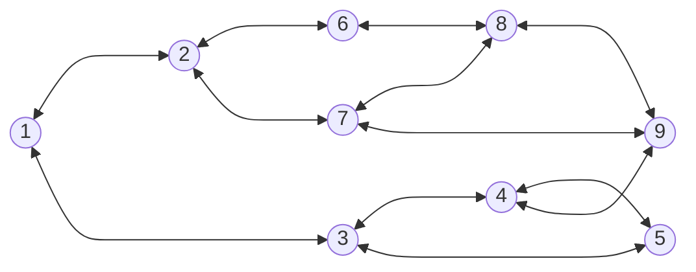
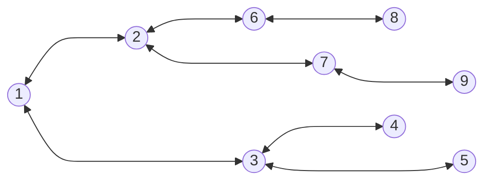

# 산책 (small) 풀이



* 어떤 그래프 $G$에 대해서 $G$의 최단 경로 트리(Shortest-path tree) $T$란 $G$의 스패닝 트리(Spanning tree)로, $T$에서 정점 $S$에서 나머지 모든 정점까지의 거리가 $G$에서의 최단 거리와 같은 트리입니다.

* 예를 들어 위 그래프의 $1$번 정점을 루트로 하는 최단 경로 트리 중 하나는 이와 같습니다. 최단 경로 트리는 여러 개 존재할 수 있습니다.
	* 루트 $r$로부터 나머지 모든 정점까지의 거리를 구하면 기존 그래프에서 최단 경로 트리를 구할 수 있습니다. $d_u$가 $r$에서 $u$까지의 거리라고 할 때, $G$의 간선 $(u, v)$에 대해서 $d_u + 1 = d_v$이면 간선 $(u, v)$는 최단 경로 트리에 속합니다.

* 이 문제에서 $S-E$의 경로 중 사전 순으로 가장 앞서는 경로를 찾기 위해서 최단 경로 트리를 이용합니다. 
	* $S$에서 시작해서 최단 경로 트리를 따라 $E$까지 가는 경로를 찾습니다. 사전 순으로 앞선 경로를 구하기 위해서는 사전 순으로 가장 앞서는 간선을 골라서 최단 경로를 찾으면 됩니다.

* 사전 순으로 가장 앞선 경로를 구했다면 해당 경로에 속하는 $S, E$를 제외한 정점을 삭제하고 다시 최단 거리를 구해주면 됩니다.

# 소스 코드
```cpp
#include <bits/stdc++.h>

using namespace std;

int main() {
	int n, m;
	cin >> n >> m;

	vector<vector<int>> adj(n + 1);
	for (int i = 0; i < m; i++) {
		int u, v;
		cin >> u >> v;

		adj[u].push_back(v);
		adj[v].push_back(u);
	}

	int s, e;
	cin >> s >> e;

	queue<int> q;
	vector<int> d(n + 1, -1);

	q.push(e);
	d[e] = 0;

	while (!q.empty()) {
		auto u = q.front();
		q.pop();

		for (auto v : adj[u]) {
			if (d[v] == -1) {
				q.push(v);
				d[v] = d[u] + 1;
			}
		}
	}

	vector<int> r(n + 1);
	int u = s;
	r[u] = true;
	while (u != e) {
		int c = n + 1;

		for (auto v : adj[u]) {
			if (d[u] - 1 == d[v]) { // 최단 경로 트리에 속하는 간선만 확인
				c = min(c, v);
			}
		}

		u = c;
		r[u] = true;
	}
	r[s] = r[e] = false;

	int sum = d[s];
	d = vector<int>(n + 1, -1);

	q.push(e);
	d[e] = 0;

	while (!q.empty()) {
		auto u = q.front();
		q.pop();

		for (auto v : adj[u]) {
			if (d[v] == -1 && !r[v]) {
				q.push(v);
				d[v] = d[u] + 1;
			}
		}
	}

	sum += d[s];
	cout << sum << '\n';
}
```
