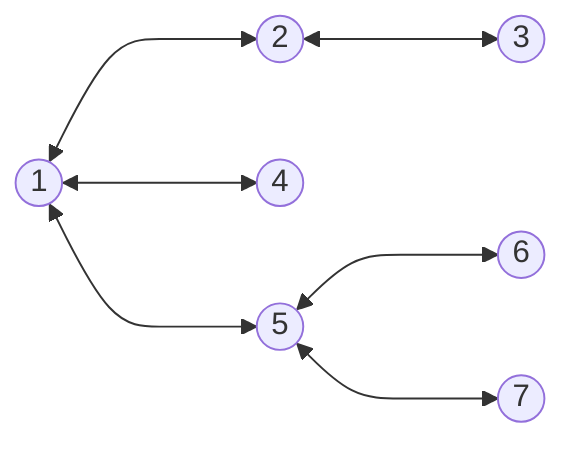
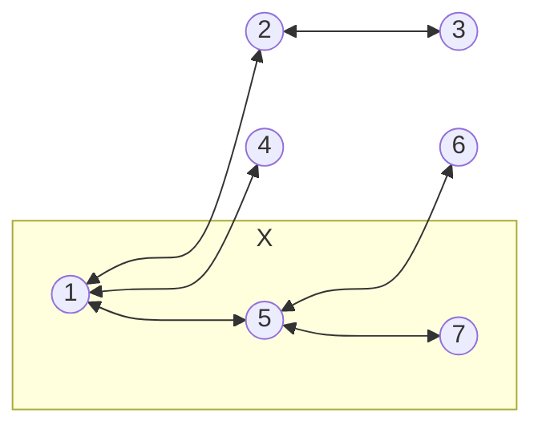

# 대전 도시철도 2호선 풀이


* 트리는 사이클이 없는 연결 그래프입니다.
* $1$번 정점에서 그래프 탐색을 진행하면서 정점 $u$에서 정점 $v$로 이동할 때마다 $v$의 부모 정점이 $u$임을 기록하면 $1$번 정점에서 $u$번 정점까지 경로를 구할 수 있습니다.
* $1-N$ 경로 위의 정점을 $a_1, a_2, \cdots, a_M$라고 할 때, 이 정점들을 하나의 정점 $X$로 합친 그래프 $G_D$를 고려해 봅시다.

* $G_D$는 $X$를 루트로 하는 트리로 생각할 수 있습니다. $S - E$ 경로 상에 $a_1, a_2, \cdots, a_M$가 적어도 하나 포함되도록 하려면 서로 다른 서브 트리에서 $S$와 $E$를 골라야합니다.
* 각 서브 트리의 크기를 $s_1, s_2, \cdots, s_K$라고 하면 정답은 $\sum_{i = 1}^{K} s_i \times (\sum s - s_i)$입니다. 두 교차로의 순서를 바꾼 것은 같은 경우이기 때문에 $2$로 나눠줘야 합니다.
# 소스 코드
```cpp
#include <bits/stdc++.h>

using namespace std;

int main() {
    int n;
    cin >> n;

    vector<vector<int>> adj(n + 1);
    for (int i = 0; i < n - 1; i++) {
        int u, v;
        cin >> u >> v;

        adj[u].push_back(v);
        adj[v].push_back(u);
    }

    vector<int> p(n + 1); // p[u] = 정점 u의 부모 정점
    auto dfs = [&](int u, int f, auto& dfs) -> void {
        for (auto v : adj[u]) if (v != f) {
            dfs(v, u, dfs);
            p[v] = u;
        }
        };

    dfs(1, 0, dfs);

    vector<int> d(n + 1); // 1-n 경로 상에 있는 정점이면 true
    for (int x = n; x != 0; x = p[x]) {
        d[x] = true;
    }

    vector<int> b(n + 1); // dfs 방문 배열
    // 정점 u가 속한 컴포넌트의 크기 반환
    auto dfs2 = [&](int u, auto& dfs2) -> int {
        b[u] = true;

        int c = 1;
        for (auto v : adj[u]) if (!b[v] && !d[v]) {
            c += dfs2(v, dfs2);
        }
        return c;
        };

    vector<int> s;
    for (int u = 1; u <= n; u++) {
        if (!b[u] && !d[u]) {
            s.push_back(dfs2(u, dfs2));
        }
    }

    long long t = accumulate(ALL(s), 0LL);

    long long sum = 0;
    for (auto x : s) {
        sum += x * (t - x);
    }

    cout << sum / 2 << '\n';
}
```
